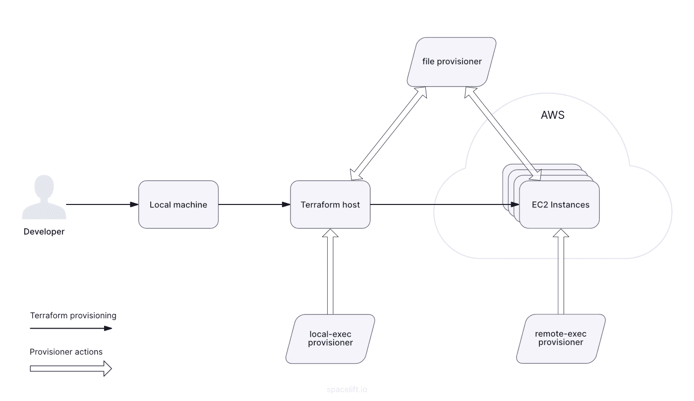

# Jan 8 - (Cloud-init and Terraform Provisioners)

## [Terraform Provisioners](https://spacelift.io/blog/terraform-provisioners#what-is-a-terraform-provisioner)

* Provisioning mainly deals with configuration activities that happen after the resource is created.
* It may involve some file operations, executing CLI commands, or even executing the script.
* Once the resource is successfully initialized, it is ready to accept connections.
* These connections help Terraform log into the newly created instance and perform these operations.

## [Types of Provisioners](https://spacelift.io/blog/terraform-provisioners#terraform-provisioners-types)



### file
```bash

data "aws_ami" "ubuntu" {
    filter {
        name   = "name"
        values = ["ubuntu-*"]
    }
    most_recent = true
}

resource "aws_instance" "my_vm" {
 ami           = data.aws_ami.ubuntu.id
 instance_type = "t2.micro"
 
 key_name        = "tfsn"
 security_groups = [aws_security_group.http_access.name]
 
 provisioner "file" {
   source      = "source_path"
   destination = "dest_path"
 }
 connection {
   type        = "ssh"
   host        = self.public_ip
   user        = "ec2-user"
   private_key = file("~/.ssh/id_rsa")
 }
 
 tags = {
   Name = "Something"
 }
}
```
### local-exec
* The local-exec provisioner works on the Terraform host – where Terraform configuration is applied/executed.
* It is used to execute any shell command.
* It is used to set or read environment variables, details about the resource created, invoke any process or application, etc.

```bash

data "aws_ami" "ubuntu" {
    filter {
        name   = "name"
        values = ["ubuntu-*"]
    }
    most_recent = true
}

resource "aws_instance" "my_vm" {
    ami           = data.aws_ami.ubuntu.id
    instance_type = "t2.micro"
    
    provisioner "local-exec" {
        command = "echo ${self.private_ip} >> private_ip.txt"
    }
    
    tags = {
        Name = var.name_tag,
    }
}
```

### remote-exec

* the commands are executed on the target EC2 instance instead of Terraform host.


## [create-time & destroy-time Provisioners ](https://spacelift.io/blog/terraform-provisioners#when-to-run-the-provisioners)

```bash
resource "aws_instance" "my_vm" {
 ami           = var.ami //Amazon Linux AMI
 instance_type = var.instance_type
 
 provisioner "local-exec" {
   command = "echo 'Creation is successful.' >> creation.txt"
 }
 
 provisioner "local-exec" {
   when = destroy
   command = "echo 'Destruction is successful.' >> destruction.txt"
 }
 
 tags = {
   Name = var.name_tag,
 }
}
```

## [Limitations of Provisioners](https://spacelift.io/blog/terraform-provisioners#why-provisioners-should-be-a-last-resort)